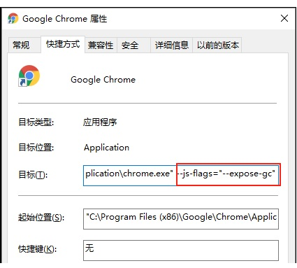

## 内存泄漏


## 思路一
gc回收 + 弱引用

gc回收之后，如果弱引用的对象还在，那么就是风险。

**辅助：**
1. window.performance.memory
```js
jsHeapSizeLimit: 4294705152
totalJSHeapSize: 25623699
usedJSHeapSize: 22361491
```


### chrome开启gc
设置启动参数，如下图
```js
--js-flags="--expose-gc"
```



更多的启动参数
*  [List of Chromium Command Line Switches](https://peter.sh/experiments/chromium-command-line-switches/)
*  [Chrome启动参数最全集合](https://blog.csdn.net/mimishy2000/article/details/88315347)


### chrome其他技巧

方式一：开启Chrome自带的并行下载功能

在地址栏输入 chrome://flags/,然后在搜索框中输入 Parallel downloading，选择enabled，重启Chrome